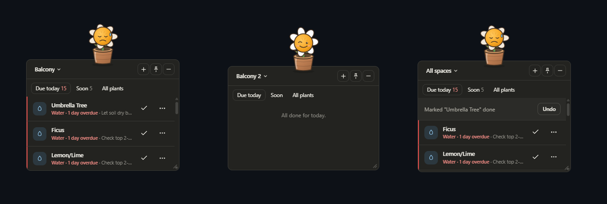

# Plant Health Tracker

A frameless, always-available Windows desktop widget for keeping plants
alive. It tracks watering and feeding across your plants and adjusts the
schedule to the season, entirely offline -- no account, no network, no
cloud. Built for a Bengaluru balcony, so the schedule engine thinks in
terms of hot-dry, monsoon, and mild seasons on IST.



## Why

Plant care apps are phone apps, and a phone app is easy to ignore. This
lives on the desktop as a small always-on card: if something needs water
today, it's already on screen. The mascot's mood reflects the worst state
in the list -- happy when nothing's due, wilting when something's overdue --
so the widget is glanceable without reading a single row.

## Features

- **Season-aware scheduling.** Watering intervals shift across hot-dry
  (Mar-May), monsoon (Jun-Oct), and mild (Nov-Feb) seasons, and vary by the
  plant's moisture class and whether it's in a hanging pot.
- **Feeding schedules** per plant group (flowering/fruiting, citrus,
  foliage, herb/succulent), including a dormancy window where feeding
  pauses over Nov-Feb and resumes automatically.
- **Catch-up rule.** Close the app for a week and you get one overdue item
  per plant, not a pile of stacked missed cycles.
- **Spaces.** Group plants by where they live -- balcony, kitchen, bedroom --
  and filter the widget to one space at a time.
- **Undo on every action.** Done / snooze / skip hold for a few seconds
  before they're written, so a mis-click costs nothing.
- **Plant details** with uses, cultural significance, and a fun fact for
  each of the seeded plants.
- **All-clear state** that shows a fact about a plant you actually own
  instead of an empty list.
- Daily digest notification, tray icon, pin-on-top, minimise-to-tray,
  single-instance guard, and light/dark themes.

## Stack

- **`src-tauri/`** -- Rust backend (Tauri v2): schedule engine, local JSON
  persistence with atomic writes, reminder loop, tray icon, autostart,
  single-instance guard.
- **`src/`** -- React + TypeScript frontend.
- **`src-tauri/tests/schedule_tests.rs`** -- unit tests for schedule logic.

No database and no ORM: three JSON files written atomically (temp file +
rename), which is plenty for a single-user widget and keeps the whole thing
inspectable in a text editor.

## Prerequisites

1. **Rust** -- via [rustup.rs](https://rustup.rs). Restart your terminal after.
2. **Node.js** 18+.
3. **Microsoft C++ Build Tools** with the *Desktop development with C++*
   workload -- Tauri needs the MSVC linker. See
   [Tauri prerequisites](https://v2.tauri.app/start/prerequisites/).
4. **Tauri CLI** -- comes in automatically via `@tauri-apps/cli`, no global
   install needed.

## Running it

```powershell
npm install
npm run tauri dev
```

On first launch it seeds the plant list and opens an initial watering and
feeding event for each plant. That happens once -- after that your own
edits in the app are the source of truth.

Data lives in `%APPDATA%\com.ameya.plant-health-tracker\` as `plants.json`,
`care-log.json`, `spaces.json` and `settings.json`.

### UI preview without the desktop shell

`preview.html` runs the real React UI in a plain browser tab against a
mocked Tauri IPC layer (via `@tauri-apps/api/mocks`), which makes it much
faster to iterate on styling than relaunching the native window:

```powershell
npm run dev
```

then open `http://localhost:1420/preview.html`. It's dev-only and isn't part
of the production build.

## Building an installer

```powershell
npm run tauri build
```

Produces MSI and NSIS installers under `src-tauri/target/release/bundle/`.

## Known gaps

- **Settings panel isn't built.** The tray's "Settings" item and the
  `open-settings` event are wired, and `get_settings` / `update_settings`
  exist, but there's no UI -- notification time and density mode are only
  changeable by editing `settings.json` by hand.
- **`launch_at_startup` isn't wired to the autostart plugin.** The setting
  is stored and round-trips correctly, but nothing calls the plugin's
  enable/disable, so toggling it won't actually register the app with
  Windows startup yet.
- **No edit form for plants.** You can add a plant and view its details,
  but changing one after the fact needs the `update_plant` command hooked
  up to a form.
- **Icons are placeholders.** `src-tauri/icons/` holds simple generated
  icons. `tray-icon.png` is present but unreferenced -- the tray currently
  falls back to the default window icon.
- **Two inferred data points.** Ixora's watering class and Indian Borage's
  light class weren't in the source inventory, so reasonable defaults are
  marked `inferred: true` and flagged with a `*` in the All plants tab.
  Worth confirming after a few weeks of real use.

## Tests

```powershell
cd src-tauri
cargo test
```

Covers schedule generation across plants and seasons, month-boundary season
transitions, the fertilizing dormancy window, done/snooze/skip recomputation,
multi-day-offline catch-up, and atomic-write round-trips.
